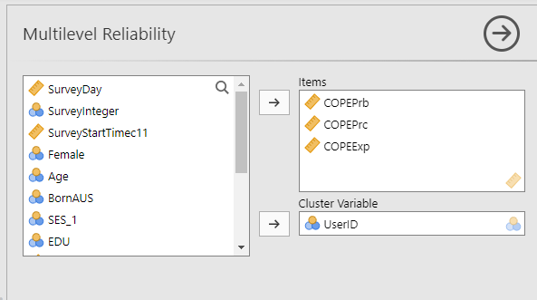

<!-- README.md is generated from README.Rmd. Please edit that file -->

```{r, include = FALSE}
knitr::opts_chunk$set(
  collapse = TRUE,
  comment = "#>",
  fig.path = "man/figures/README-",
  out.width = "100%"
)
```

# ESMhelpers

<!-- badges: start -->

<!-- badges: end -->

The goal of ESMhelpers is to provide jamovi users access to a couple of R functions from existing R packages to use in multilevel analysis of experience sampling data.

## Installation

You can install the development version of ESMhelpers from [GitHub](https://github.com/) with:

``` r
# install.packages("pak")
pak::pak("marwinar/ESMhelpers")
```

## Example

How to calculate omega on within and between group level:

1.  Specify the items that make a scale.
2.  Specify the cluster variable / grouping variable.



### Jamovi output


The output gives both omega within and omega between with a 95% confidence interval (LL = lower limit; UL: upper limit).

### In R

```{r example}
library(ESMhelpers)
data(aces_daily, package = "JWileymisc")
ESMhelpers::omega(data = aces_daily, 
                  items = c("COPEPrb", "COPEPrc", "COPEExp"),
                  group = "UserID")

```

For comparison, this is how the same analysis would look in R with package multilevelTools:

```{r}
library(multilevelTools)
omegaSEM(
  items = c("COPEPrb", "COPEPrc", "COPEExp"),
  id = "UserID",
  data = aces_daily,
  savemodel = FALSE)
```
