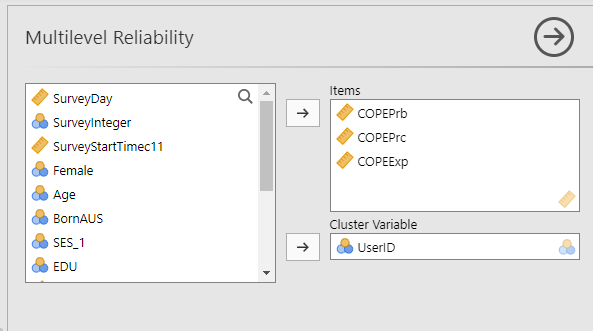
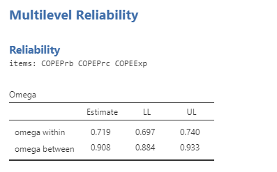

<!-- README.md is generated from README.Rmd. Please edit that file -->

# ESMhelpers

<!-- badges: start -->
<!-- badges: end -->

The goal of ESMhelpers is to provide jamovi users access to a couple of
R functions from existing R packages to use in multilevel analysis of
experience sampling data.

## Installation

You can install the development version of ESMhelpers from
[GitHub](https://github.com/) with:

``` r
# install.packages("pak")
pak::pak("marwinar/ESMhelpers")
```

## Example

How to calculate omega on within and between group level:

1.  Specify the items that make a scale.
2.  Specify the cluster variable / grouping variable.



### Jamovi output



The output gives both omega within and omega between with a 95%
confidence interval (LL = lower limit; UL: upper limit).

### In R

``` r
library(ESMhelpers)
data(aces_daily, package = "JWileymisc")
ESMhelpers::omega(data = aces_daily, 
                  items = c("COPEPrb", "COPEPrc", "COPEExp"),
                  group = "UserID")
#> 
#>  MULTILEVEL RELIABILITY ANALYSIS
#> items: COPEPrb COPEPrc COPEExp
#>  Omega                                                    
#>  ──────────────────────────────────────────────────────── 
#>                     Estimate     LL           UL          
#>  ──────────────────────────────────────────────────────── 
#>    omega within     0.7185961    0.6968023    0.7403899   
#>    omega between    0.9083446    0.8836368    0.9330523   
#>  ────────────────────────────────────────────────────────
```

For comparison, this is how it would look in R with package
multilevelTools:

``` r
library(multilevelTools)
#> Warning: package 'multilevelTools' was built under R version 4.4.2
omegaSEM(
  items = c("COPEPrb", "COPEPrc", "COPEExp"),
  id = "UserID",
  data = aces_daily,
  savemodel = FALSE)
#> $Results
#>            label   est ci.lower ci.upper
#> 25  omega_within 0.719    0.697    0.740
#> 28 omega_between 0.908    0.884    0.933
```
